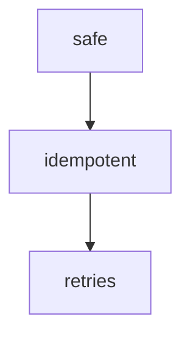

# notes/

Summaries, lessons and your own notes, numbered. Plain Markdown: it opens in Obsidian, on GitHub or in any editor.

```example
notes/
├── 01-methods-and-status-codes.md
├── 02-caching.md
├── 03-idempotency.md
└── img/
    └── 3f9a1c0b7e2d4a51.png
```

- **written by**: you in the [app](editor.md), [slp-summarize](slp-summarize.md), [slp-teach](slp-teach.md)
- **format**: one `#` per file, topics `##`, subtopics `###`, lists `- `
- **names**: the app renames files from their `#` heading on every save: `NN-<heading>.md`
- **images**: `img/<hash>.<ext>`, managed by the app

## Diagrams and formulas

A fenced block is drawn in the app, in notes and in exams. Use it when a drawing says more than prose.

````03-idempotency.md


```math
p_{99} = \frac{a}{b}
```
````

- **mermaid**: any [Mermaid](https://mermaid.js.org/) diagram
- **math**: one [KaTeX](https://katex.org/) formula per block, display mode

## Marks and cards

Marks with their color and comment, margin notes with their position, and resized images are kept as HTML inside the Markdown, so they survive the round trip:

```raw html
<mark class="mk-highlight" style="--c: var(--ansi-yellow, #d8c06a);" data-comment="...">text</mark>
<aside class="card" data-x="768" data-y="120"><div class="card-body">...</div></aside>
```

References are `[[heading]]`.
