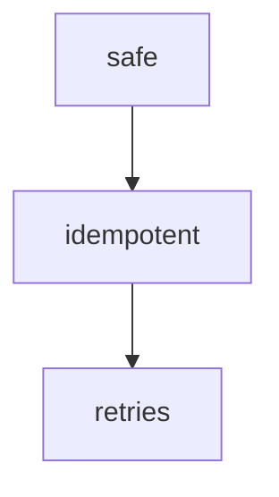

# Teach

Teaches so it ends up understood, not memorized. Probes your real level, plans the topic as a dependency graph and builds it node by node from truths you already accept.

```usage
/slp-teach why is PUT idempotent and POST not?
```

````notes/03-idempotency.md
# Idempotency

## Why it matters
...
````

- **triggers**: "teach me", "explain", "I don't get it", any explanation
- **principles**: unconditional truths first · "how could I have discovered this myself?"
- **persona**: when the topic has a [teacher](teacher.md), it teaches as that persona in the same conversation
- **reads**: `learning.md`, `wiki/index.md` and the concept pages, the topic's sources
- **writes**: a new `notes/NN-title.md`, `learning.md`, one [wiki](wiki.md) concept per node taught, `progress/status.md`
- **after**: asks whether the lesson finished the unit; if not, reminds you that [cards](slp-cards.md) turn it into retention

## Process

1. probe, never skipped
2. plan the dependency graph, then wait for your go-ahead
3. teach, node by node
